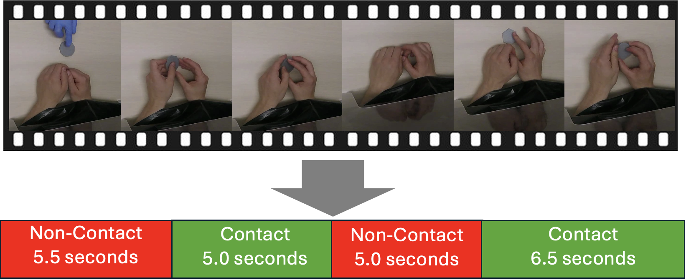
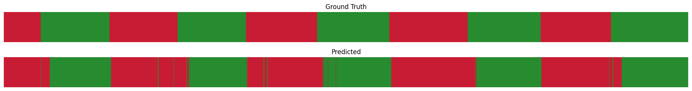
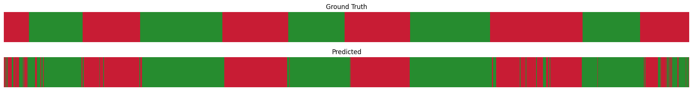
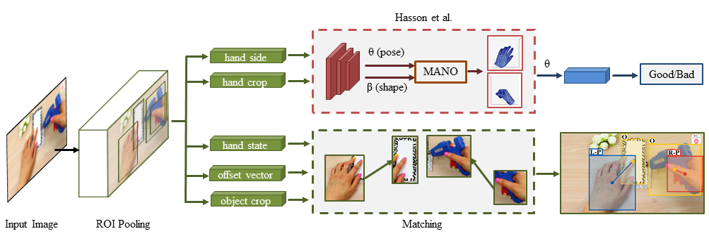


# Contact Duration Detection
For my senior honours thesis in the <a href="https://pnb.mcmaster.ca/goldreich-lab/CurrentRes.html#Modeling">Goldreich Lab</a>, we have collected 500+ hours of videos of participants' hands as they perform our haptic categorization experiment. My aim is to automatically detect how long participants hold objects in these videos.
### Goal


### Preliminary Results


## Method
<b>Overview of proposed technique</b>
<ol>
<li>Use <a href="https://github.com/ddshan/hand_object_detector">100-DOH</a> to assign frame-wise labels to video.</li>
<li>Refine predictions to minimize over-segmentation error.</li>

<b>Segment refining techniques</b>
Sometimes the 100-DOH network detects the object in the hand of the experimenter, who wears blue latex gloves. These false positives are easy to eliminate: in each frame where a hand in contact with an object is detected, we identify the amount of blue inside the bounding box of the hand in contact with the object; if the bounding box contains mostly blue pixels, then we can be sure that the hand touching the object is wearing a latex glove and belongs to the experimenter. We can therefore conclude that the frame was initially a false positive.

We are still desciding on the best method to refine segmentations. Current ideas include:
<ul>
<li>Dual pass gap elimination. Example: fill in any gaps between predicted "contact" labels lasting fewer than 10 frames with "contact" labels. Subsequently, gaps between predicted "non-contact" labels lasting fewer than 5 frames are similarly filled.</li>
<li>Sliding window voting: a sliding window could assign frame-wise labels using majority voting</li>

</ul>
According to <a href="https://arxiv.org/abs/2210.10352">Ding et al.</a>, the <a href="https://arxiv.org/abs/2007.06866">ASRF</a> network can refine temporal segmentations in a model-indipendent way by considering predicted labels, frame features and temporal context. We hope to investigate using it as part of our refinement sequence

## Future directions
<b>Weakly-Supervised Temporal Action Segmentation</b>
We hope to the identify frames from our refined 100-DOH predictions which have very confident predicted labels. These labels can be fed into a temporal action segmentation (TAS) model which learns from time-stamp supervision. Time-stamp supervision involves labeling as few as a single frame from each action category in the training set. Performance is only a few years behind fully supervised TAS methods. The models from <a href="https://arxiv.org/abs/2103.06669">Li et al., 2021</a> and <a href="https://arxiv.org/abs/2212.11694">Du et al., 2022</a> serve as possible options for implimentation.


<b>Extending our method for robust detection: self-supervised sister network</b>
We hope to extend our method by adding a self-supervised object detector network which runs alongside the existing R-CNN detection network. This network would be taylor-made to recognize the gray coin-shaped objects from our experiment. 

The current <a href="https://github.com/ddshan/hand_object_detector">100-DOH</a> network is trained to recognize when hands are in contact with generic portable and stationary objects. It can often identify when participant hands are in contact with our object, but sometimes fails to, especially near the initiation of contact when the object is still on the table. We could extract object bounding boxes from 100-DOH, and use the results as training data for a supervised object detector. With this labeled data, this sister detector will be able to identify our object more accuratley than the current generic portable object detector. In this way, we could avoid a human in the loop, and end up with a detector tailor-made for our objects.  When the hand bounding box generated by the current network overlaps with the sister network's object bounding box, we can determine that the participant's hands are in contact with the object.

The automated nature of labeled data aquisition for the sister network aleviates concerns about overfitting: we can train the network on frames from every video it will eventually perform inference on because the network will not need to generalize to different videos, only different sections of video in the labeled training set.


<b>Comparisons to other techniques</b>
We hope to attempt to compare our method a more conventional temporal action segmentation technique. One wich requires only timestamp supervision (infrequently labeled frames with associated timestamps) would be suitable for our task.
## About this repository
Adopted from [100-DOH Repository](https://github.com/ddshan/hand_object_detector), which is the code for the paper *Understanding Human Hands in Contact at Internet Scale* (CVPR 2020, **Oral**).

Dandan Shan, Jiaqi Geng*, Michelle Shu*, David F. Fouhey



More information can be found at the* [Project and dataset webpage](http://fouheylab.eecs.umich.edu/~dandans/projects/100DOH/)

## Installation
This was only tested on Ubuntu 22.04 with an NVIDIA GPU. CUDA and cuDNN must be installed before using this repository.


## Prerequisites

Create a conda environment, install pytorch-1.12.1, cuda-11.3:
* python=3.8
* cudatoolkit=11.3
* pytorch=1.12.1


## Preparation

First of all, clone the code
```
git clone https://github.com/nripstein/Thesis-100-DOH && cd hand_object_detector
```

## Environment & Compilation
### Environment Setup:
Copy and paste the following commands into the command line:
```
conda create --name handobj_new python=3.8
conda activate handobj_new
conda install pytorch==1.12.1 torchvision==0.13.1 torchaudio==0.12.1 cudatoolkit=11.3 -c pytorch
pip install -r requirements.txt
cd lib
# then install gcc 10  
sudo apt install gcc-10 g++-10
export CC=/usr/bin/gcc-10
export CXX=/usr/bin/g++-10
# now that we have gcc 10, can compile
CC=/usr/bin/gcc-10 CXX=/usr/bin/g++-10 python setup.py build develop
```
Install all the python dependencies using pip:
```
pip install -r requirements.txt
```

<!-- You will meet some errors about coco dataset: (not the best but the easiest solution)
```
cd data
git clone https://github.com/pdollar/coco.git 
cd coco/PythonAPI
make
``` -->
<!-- 
If you meet some error about spicy, make sure you downgrade to scipy=1.1.0:
```
pip install scipy=1.1.0
``` -->

PS:

Since the repo is modified based on [faster-rcnn.pytorch](https://github.com/jwyang/faster-rcnn.pytorch/tree/pytorch-1.0) (use branch pytorch-1.0), if you have futher questions about the environments, the issues in that repo may help.


## Demo

### Image Demo

**Download models** by using the links in the table above from google drive.


**Save models** in the **models/** folder:
```
mkdir models

models
└── res101_handobj_100K
    └── pascal_voc
        └── faster_rcnn_{checksession}_{checkepoch}_{checkpoint}.pth
```


**Simple testing**: 

Put your images in the **images/** folder and run the command. A new folder **images_det** will be created with the visualization. Check more about argparse parameters in demo.py.
```
CUDA_VISIBLE_DEVICES=0 python demo.py --cuda --checkepoch=xxx --checkpoint=xxx
```


### One Image Demo Output:

Color definitions:
* yellow: object bbox
* red: right hand bbox
* blue: left hand bbox

Label definitions:
* L: left hand
* R: right hand
* N: no contact
* S: self contact
* O: other person contact
* P: portable object contact
* F: stationary object contact (e.g.furniture)


